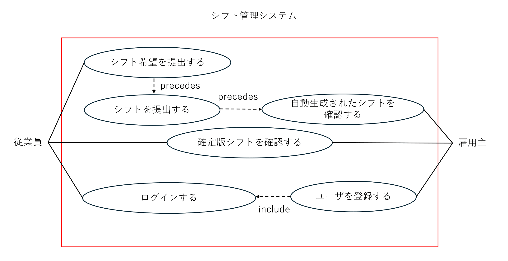

# marunage: シフト自動調整システム ユースケースモデリング
アルバイトにおけるシフト調節を自動化するシステムのユースケースモデリングを行う．

## 1. ユースケース図

## 2. ユースケース一覧
### 2.1 従業員用ユースケース
1. [ログインする](./usecase01.md)
2. [シフト希望を提出する](./usecase02.md)
3. [確定版シフトを確認する](./usecase05.md)

### 2.2 雇用主用ユースケース
1. [ログインする](./usecase01.md)
2. [ユーザを登録する](./usecase03.md)
3. [自動生成されたシフトを確認する](./usecase04.md)
4. [確定版シフトを確認する](./usecase05.md)