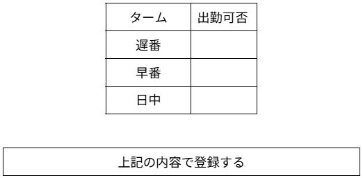

# シフト希望を提出する
## 概要

従業員がインターネット上でシフト希望を登録する

## アクター

- 従業員

## 事前条件

- 従業員がシステムにログインしていること  
- シフト希望登録期間にあること  
- シフト希望をまだ登録していないこと

## 事後条件

- 登録した時間帯にシフトが反映される

## トリガ―

- 従業員が「シフト希望提出」のメニューを選択する

## 基本フロー

1. 従業員が「シフト希望提出」のメニューを選択する  
2. システムはシフト希望を募集中のカレンダーを表示する  
3. 従業員はカレンダーの空いている日を選択する  
4. システムは登録画面としてタームを表示し，その日希望する時間帯を〇△✕で埋めるよう求める  
5. ユーザは希望するタームに〇，希望しないタームに✕，それ以外は△で埋め，「登録」ボタンを押す  
6. システムは希望された労働時間が労働基準法に則っているかを確認する  
7. 問題がなければその日の登録内容カレンダーに表示する

## 代替フロー

### 代替フロー1

- 6.a.1  基本フロー6において，労働基準法に則れていないと判断した場合，エラーを出して4に戻る

## GUI紙芝居
### カレンダー画面

コメント：「シフト希望提出」のメニューを選択するとこのような画面が出てきます

### 〇△✕選択画面

コメント：カレンダーの未登録の日をクリックするとこのような画面が出てきます

