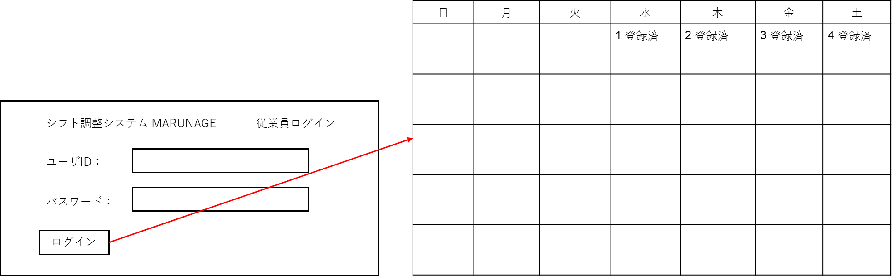

# ログインする
## 概要

従業員がシステムにログインして，シフト希望を提出する権利を取得する．

## アクター

- 従業員
- 雇用者

## 事前条件

- 従業員・雇用者がシステムにログインしていないこと

## 事後条件

- 従業員・雇用者がシステムにログインした状態になる  
- システムにユーザ登録情報画面が表示されるようになる

## トリガ―

- 従業員・雇用者が「ログイン」のメニューを選択する

## 基本フロー

1. システムは，ログイン画面を表示する．  
2. 従業員・雇用者は，ユーザIDとパスワードを入力し，ログインを押す．  
3. システムは，ユーザIDでユーザ情報を検索し，パスワードが一致するかをチェックする．  
4. パスワードが一致すれば，システムはユーザをログイン状態にする．  
5. システムはシフト希望提出画面（ユースケース1）を表示する

## 代替フロー

### 代替フロー1

- 3a.1 基本フロー3でユーザIDが存在しない場合，システムはログインエラーを出し，1に戻る．

### 代替フロー2

- 4a.1 基本フロー4でパスワードが一致しない場合，システムはログインエラーを出して，1に戻る．

## GUI紙芝居

### ログイン画面
