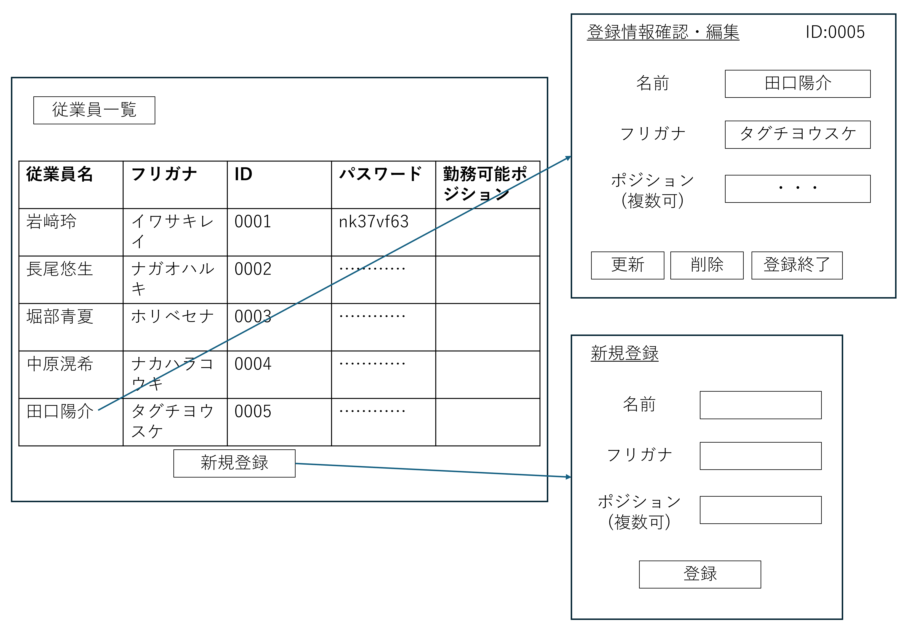

# ユーザを編集する
## 概要

雇用主が，新規従業員をシステム利用者として登録・編集・削除する．

## アクター

- 雇用主

## 事前条件

- 雇用主がシステムにログインしている  

## 事後条件

- 当該従業員の登録情報が更新される
    - 新規登録
    - 情報の変更
    - 削除

## トリガ―

- 雇用主が「従業員情報編集」のメニューを選択する

## 基本フロー
### 新規登録
1. 従業員一覧のボタンを押す．
2. システムが従業員台帳を検索し，従業員の情報を表示する.
3. 雇用主は，「新規従業員登録」ボタンを押す．  
4. システムは，登録画面を表示し，新規従業員の名前とフリガナ，勤務可能ポジションを尋ねる．  
5. 雇用主は新規従業員の名前とフリガナ，勤務可能ポジションを入力し，「登録」ボタンを押す．  
6. システムは，IDとパスワードを発行する．IDは登録順の番号，パスワードは英数字二種類を含む8桁数．  
7. 雇用主は，「登録終了ボタン」を押して閉じる．  
8. システムは，先ほど登録した従業員を含む従業員の情報を表示する．

### 編集・削除
1. システムがすでに登録している従業員の情報を表示する  
2. 雇用主は，登録されている従業員の情報をクリックする
3. システムは登録情報確認・編集画面を表示する
4. 雇用主は，入力フォーム上に存在する従業員の情報を編集することが出来る
5. 雇用主は「削除」ボタンを押すと従業員の情報を削除することが出来る
6. 雇用主は，「更新」ボタンを押すと従業員の情報を更新することが出来る．
7. 雇用主は，「登録終了」ボタンを押して閉じる．  
8. システムは，先ほど登録した従業員を含む従業員の情報を表示する．

## 代替フロー

### 代替フロー1

- 新規登録5.a.1  基本フロー4においていずれかの入力欄が空白のまま雇用主が「登録」ボタンを押した場合，登録エラーを表示し，3に戻る．  

## GUI紙芝居

### 従業員登録画面
