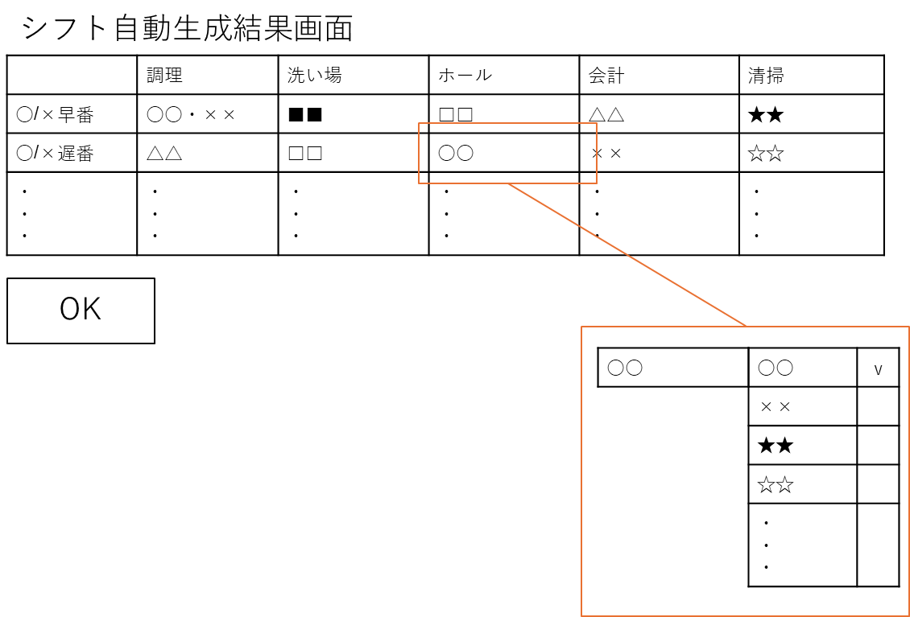

# 自動生成されたシフトを確認する
## 概要

雇用主がインターネット上で，システムが自動作成したシフトを確認し，調整をする

## アクター

- 従業員

## 事前条件

- 雇用主がシステムにログインしていること  
- 従業員のシフト登録が完了していること  
- システムによりシフトが自動作成されていること

## 事後条件

- 雇用主が最終調整したシフトが，「確定シフト」に反映される

## トリガ―

- 雇用主が「シフト作成結果を確認する」を選択する

## 基本フロー

1. システムは，シフト作成メニューを表示する．  
2. 雇用主が，システムのシフト自動作成メニューから「シフト作成結果を確認する」ボタンを押す  
3. システムは，当該シフト作成期間の自動生成されたシフトを表示する．  
4. 雇用主は，自動作成されたシフトを確認し，調整したい箇所があれば手作業で各シフト担当者を変更することが出来る  
   1. 担当者名を選択することで，プルダウンメニューが表示され担当者を変更できるようになる  
   2. プルダウンメニューは\[氏名\]\[チェックボックス\]のようになっており，チェックの有無でシフトに入る人を決定できる  
5. 変更が完了するor変更箇所がない場合は、「OK」ボタンを押す  
6. 確認画面を表示する
7. システムは、最終的に登録されたシフトの情報を「確定シフト」として登録する。

## 代替フロー

### 代替フロー1

- 2.a.1 基本フロー1で作成されたシフトが存在しない場合，システムはエラーを表示し，1に戻る．

### 代替フロー2
- 3.a.1 基本フロー6で既に確定シフトが存在している場合，基本フロー3において自動生成されたシフトでなく，確定したシフトが表示され，それについて変更を加える形になる．

## GUI紙芝居
### シフト自動生成結果画面

コメント：「確定シフト確認」を入力すると，このような表示がされます．