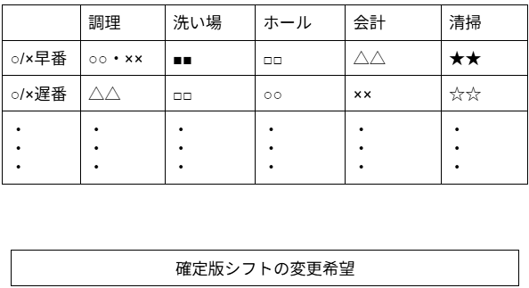

# 確定版シフトを確認する
## 概要

従業員と雇用者がインターネット上でシステムにより作成された確定版シフトを確認できるようにする

## アクター

- 従業員  
- 雇用者

## 事前条件

- 雇用者，あるいは従業員がシステムにログインしていること  
- 雇用者がシステムが作成したシフトを微修正した後、承認していること

## 事後条件

- 従業員が確定版シフトの日程を承認する

## トリガ―

- 従業員が「確定シフト確認」のメニューを選択

## 基本フロー

1. 雇用者，あるいは従業員が「確定シフト確認」ボタンを押す．  
2. システムが年月日を取得する．システムは，現時点における年月の確定版のシフト表を表示する．  
3. 従業員は，確定版シフトに問題がないかを確認する。また，従業員は，「確定版シフトの変更希望」ボタンをいつでも押せる状態となっている．  
4. 従業員が「確定版シフトの変更希望」ボタンを押した場合、雇用者に通知される．  
5. 雇用者は，従業員が入力した「確定版シフトの変更希望」の状況を確認できる．状況に応じて，この希望を承認・却下できる．  
6. システムは希望が承認されたか・却下されたかを該当従業員に通知する．

## 代替フロー

### 代替フロー1

- 1.a.1  基本フロー1において，個人別のシフトを確認したい場合，  
- 1.a.2  システムは，全体シフトではなく、ユーザ情報に応じた個人別のシフトを表示する．

## GUI紙芝居
### 確定シフト確認画面

コメント：「確定シフト確認」を入力すると，このような表示がされます．